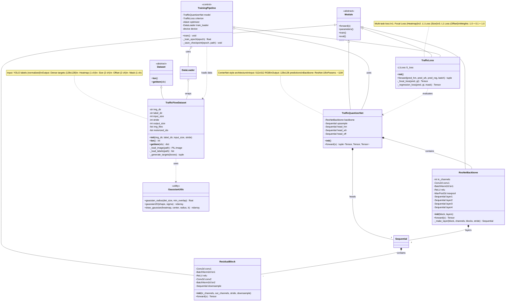
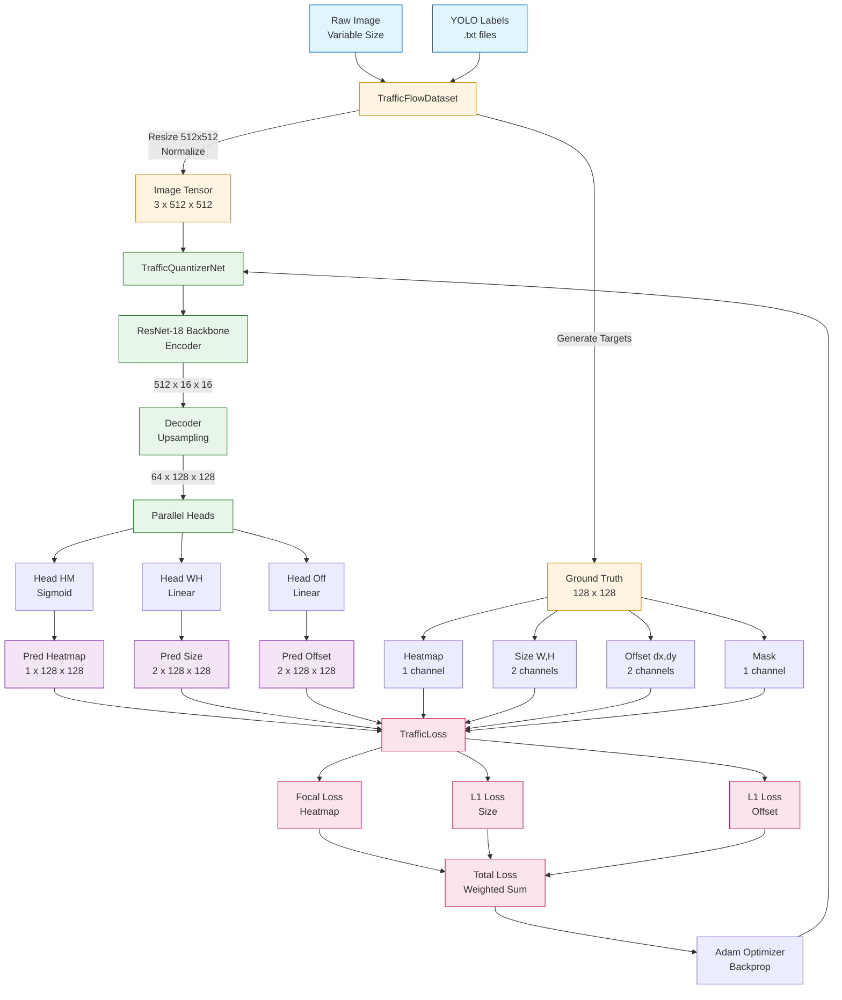
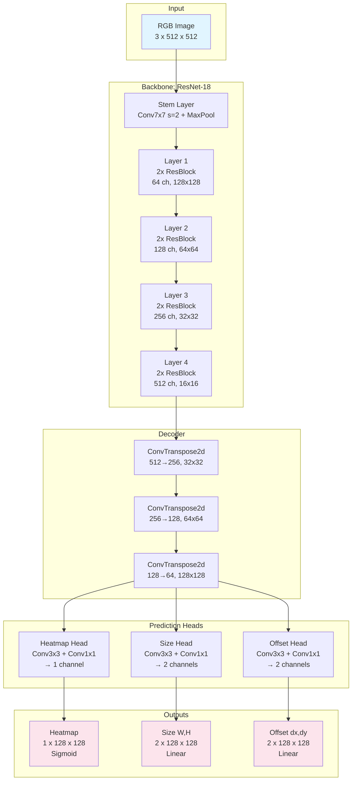

# Diagrama UML - TrafficQuantizerNet Architecture

## Diagrama de Clases Completo



## Diagrama de Flujo de Datos



## Diagrama de Secuencia - Training Loop

```mermaid
sequenceDiagram
    participant Main as train()
    participant Loader as DataLoader
    participant DS as TrafficFlowDataset
    participant Model as TrafficQuantizerNet
    participant Loss as TrafficLoss
    participant Opt as Adam Optimizer
    
    Main->>Loader: Inicializar con dataset
    
    loop Por cada época
        loop Por cada batch
            Loader->>DS: __getitem__(idx)
            DS->>DS: Cargar imagen
            DS->>DS: Generar targets gaussianos
            DS-->>Loader: {input, hm, wh, reg, mask}
            Loader-->>Main: Batch de datos
            
            Main->>Model: forward(images)
            Model->>Model: Backbone (ResNet-18)
            Model->>Model: Decoder (Upsample)
            Model->>Model: 3 Heads paralelos
            Model-->>Main: (pred_hm, pred_wh, pred_off)
            
            Main->>Loss: forward(preds, targets)
            Loss->>Loss: Calcular Focal Loss
            Loss->>Loss: Calcular L1 Size Loss
            Loss->>Loss: Calcular L1 Offset Loss
            Loss-->>Main: (total_loss, l_hm, l_wh, l_off)
            
            Main->>Opt: zero_grad()
            Main->>Main: loss.backward()
            Main->>Opt: step()
            
            alt Cada 10 steps
                Main->>Main: Log métricas
            end
        end
        
        alt Cada 5 épocas
            Main->>Main: Guardar checkpoint
        end
    end
    
    Main->>Main: Guardar modelo final
```

## Arquitectura del Modelo (Detallada)



## Componentes Clave

### 1. **TrafficFlowDataset**
- **Propósito**: Cargar imágenes y convertir anotaciones YOLO a targets densos
- **Entrada**: Imágenes + archivos .txt (YOLO format)
- **Salida**: Tensores con heatmaps gaussianos
- **Dependencias**: `GaussianUtils` para generar distribuciones

### 2. **TrafficQuantizerNet**
- **Propósito**: Modelo de detección end-to-end
- **Arquitectura**: Encoder-Decoder con múltiples cabezales
- **Backbone**: ResNet-18 (4 capas, 2 bloques c/u)
- **Decoder**: 3 capas de ConvTranspose2d
- **Heads**: 3 ramas paralelas para diferentes predicciones

### 3. **TrafficLoss**
- **Propósito**: Función de pérdida multi-tarea
- **Componentes**:
  - Modified Focal Loss (α=2, β=4)
  - L1 Loss para regresión de tamaño
  - L1 Loss para regresión de offset
- **Ponderación**: 1.0 : 0.1 : 1.0

### 4. **GaussianUtils**
- **Propósito**: Generar representaciones gaussianas de objetos
- **Funciones**:
  - `gaussian_radius()`: Calcula radio adaptativo
  - `gaussian2D()`: Genera kernel gaussiano
  - `draw_gaussian()`: Dibuja en heatmap con max-pooling

## Parámetros del Modelo

| Componente | Parámetros | Salida |
|------------|-----------|--------|
| **Stem** | ~9K | 64 x 128 x 128 |
| **Layer 1** | ~148K | 64 x 128 x 128 |
| **Layer 2** | ~525K | 128 x 64 x 64 |
| **Layer 3** | ~2.1M | 256 x 32 x 32 |
| **Layer 4** | ~8.4M | 512 x 16 x 16 |
| **Decoder** | ~3.5M | 64 x 128 x 128 |
| **Heads** | ~40K | 5 x 128 x 128 |
| **TOTAL** | **~11.4M** | - |

