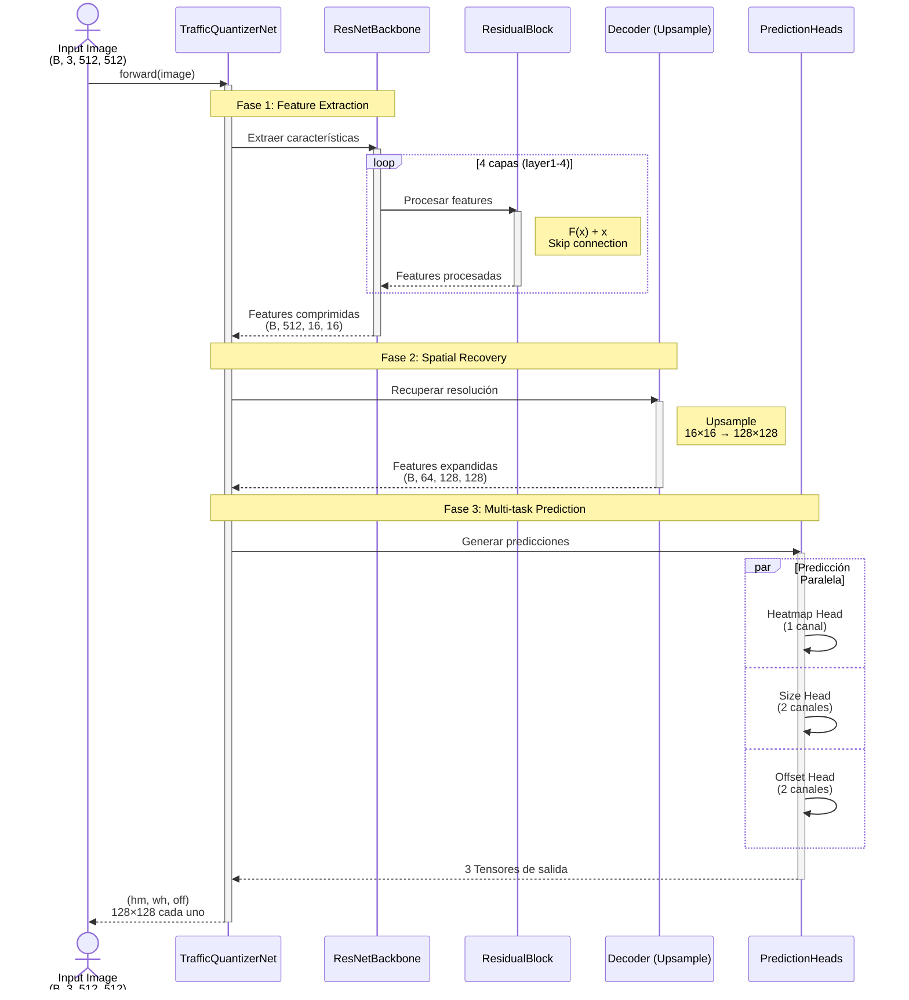
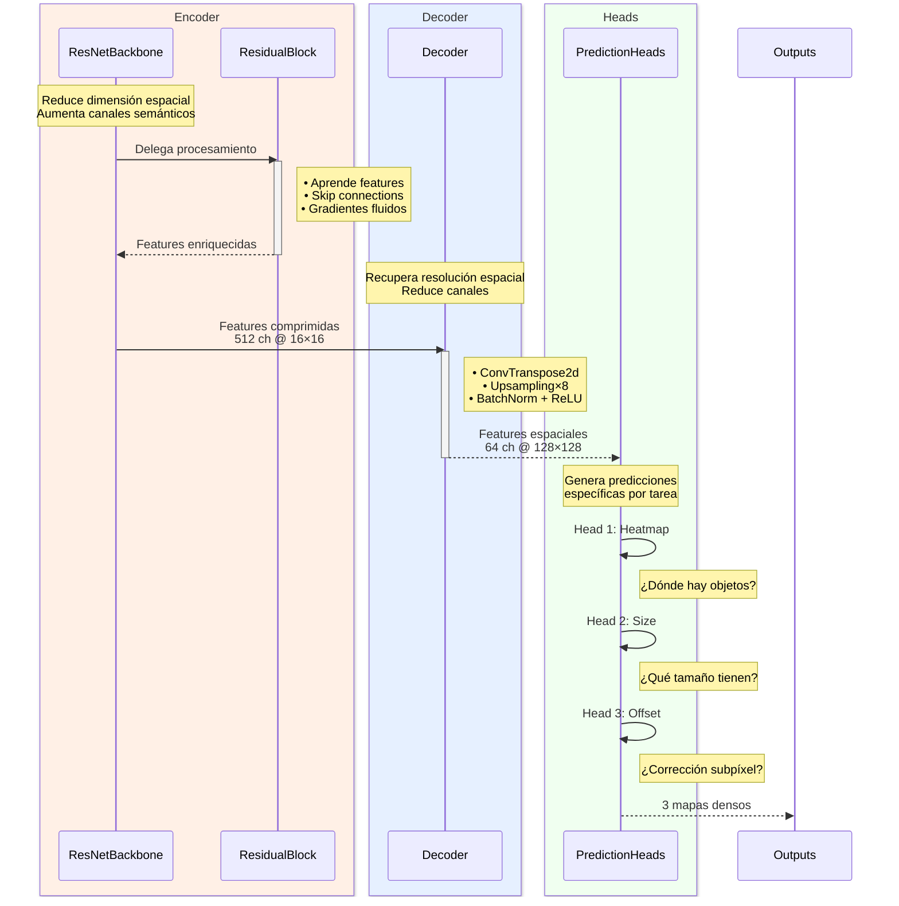
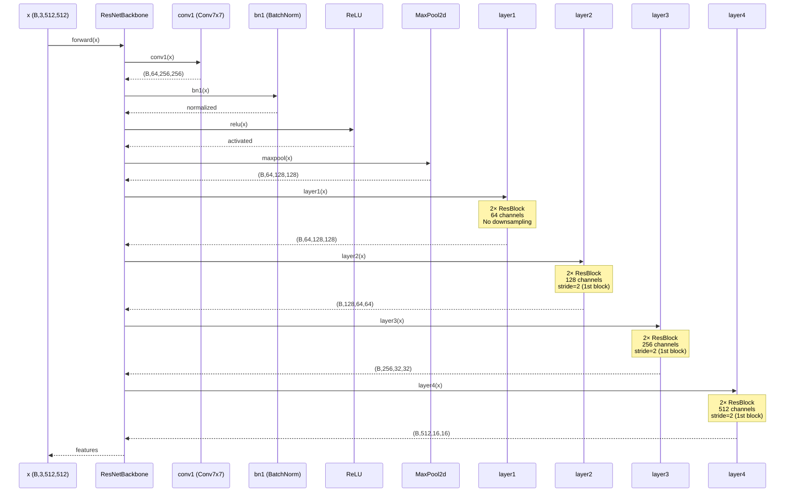
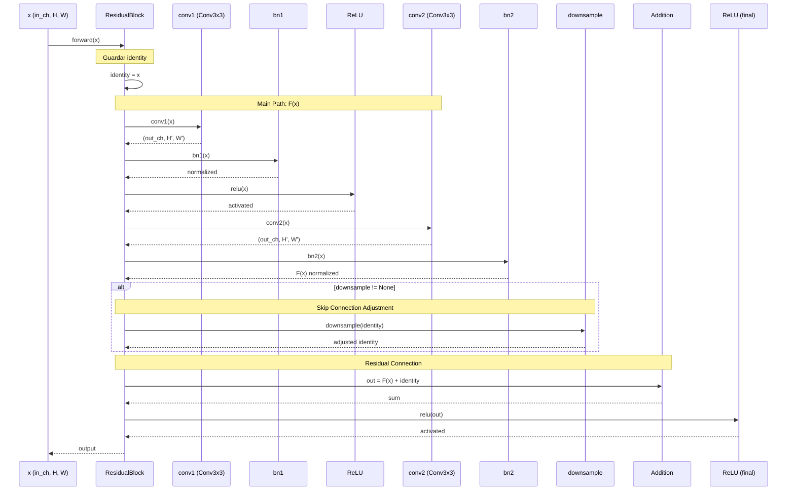
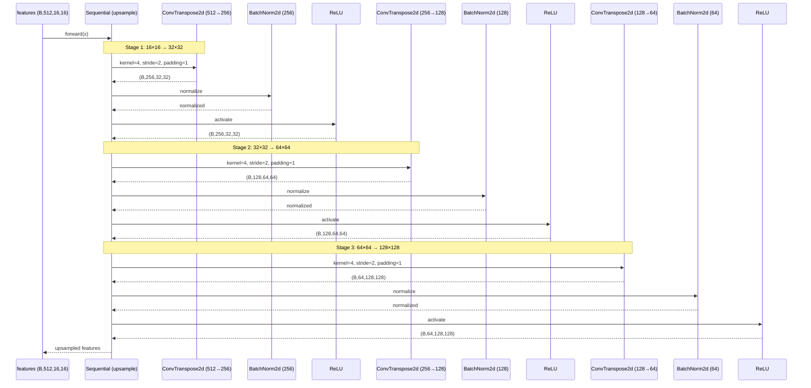
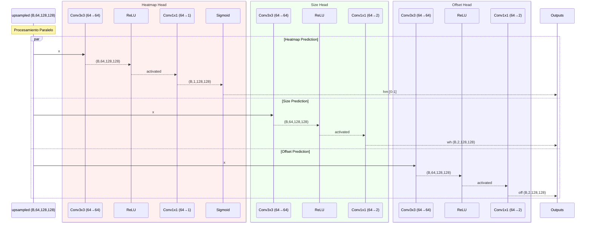

# Diagrama de Secuencia - TrafficQuantizerNet

## Diagrama Simplificado (Alto Nivel)

### Interacción entre Componentes Principales



## Rol de Cada Componente



## Función de Cada Clase

| Clase | Responsabilidad | Input | Output |
|-------|----------------|-------|--------|
| **ResNetBackbone** | Extracción de características<br/>Compresión espacial | (B, 3, 512, 512) | (B, 512, 16, 16) |
| **ResidualBlock** | Transformación no lineal<br/>con skip connection | (B, C_in, H, W) | (B, C_out, H', W') |
| **Decoder** | Recuperación espacial<br/>Upsampling progresivo | (B, 512, 16, 16) | (B, 64, 128, 128) |
| **PredictionHeads** | Predicciones multi-tarea<br/>paralelas | (B, 64, 128, 128) | 3× (B, C, 128, 128) |

---

## Lógica Interna del Modelo (Detallada)

### Secuencia de Forward Pass Completo

```mermaid
sequenceDiagram
    participant Input as Input Tensor<br/>(B, 3, 512, 512)
    participant TQN as TrafficQuantizerNet
    participant BB as ResNetBackbone
    participant Stem as Stem Layer
    participant L1 as Layer1 (ResBlocks)
    participant L2 as Layer2 (ResBlocks)
    participant L3 as Layer3 (ResBlocks)
    participant L4 as Layer4 (ResBlocks)
    participant Dec as Decoder (Upsample)
    participant HM as Head Heatmap
    participant WH as Head Size
    participant OFF as Head Offset
    participant Out as Output Tuple
    
    Input->>TQN: forward(x)
    activate TQN
    
    Note over TQN: Llamada al Backbone
    TQN->>BB: backbone.forward(x)
    activate BB
    
    Note over BB,Stem: Fase 1: Reducción Inicial
    BB->>Stem: Stem(x)<br/>Conv7x7 stride=2
    Stem-->>BB: (B, 64, 256, 256)
    BB->>Stem: MaxPool stride=2
    Stem-->>BB: (B, 64, 128, 128)
    
    Note over BB,L1: Fase 2: Feature Extraction
    BB->>L1: layer1(x)
    activate L1
    loop 2 ResidualBlocks
        L1->>L1: ResBlock.forward()
        Note right of L1: F(x) + x
    end
    L1-->>BB: (B, 64, 128, 128)
    deactivate L1
    
    BB->>L2: layer2(x)
    activate L2
    loop 2 ResidualBlocks
        L2->>L2: ResBlock.forward()
        Note right of L2: Downsample: stride=2
    end
    L2-->>BB: (B, 128, 64, 64)
    deactivate L2
    
    BB->>L3: layer3(x)
    activate L3
    loop 2 ResidualBlocks
        L3->>L3: ResBlock.forward()
        Note right of L3: Downsample: stride=2
    end
    L3-->>BB: (B, 256, 32, 32)
    deactivate L3
    
    BB->>L4: layer4(x)
    activate L4
    loop 2 ResidualBlocks
        L4->>L4: ResBlock.forward()
        Note right of L4: Downsample: stride=2
    end
    L4-->>BB: (B, 512, 16, 16)
    deactivate L4
    
    BB-->>TQN: features (B, 512, 16, 16)
    deactivate BB
    
    Note over TQN,Dec: Fase 3: Decoder (Upsampling)
    TQN->>Dec: upsample(features)
    activate Dec
    Dec->>Dec: ConvTranspose2d<br/>512→256, stride=2
    Note right of Dec: (B, 256, 32, 32)
    Dec->>Dec: BatchNorm + ReLU
    Dec->>Dec: ConvTranspose2d<br/>256→128, stride=2
    Note right of Dec: (B, 128, 64, 64)
    Dec->>Dec: BatchNorm + ReLU
    Dec->>Dec: ConvTranspose2d<br/>128→64, stride=2
    Note right of Dec: (B, 64, 128, 128)
    Dec->>Dec: BatchNorm + ReLU
    Dec-->>TQN: upsampled (B, 64, 128, 128)
    deactivate Dec
    
    Note over TQN,OFF: Fase 4: Prediction Heads (Paralelos)
    
    par Head Heatmap
        TQN->>HM: head_hm(upsampled)
        activate HM
        HM->>HM: Conv3x3 (64→64)
        HM->>HM: ReLU
        HM->>HM: Conv1x1 (64→1)
        HM->>HM: Sigmoid
        HM-->>TQN: hm (B, 1, 128, 128)<br/>[0-1]
        deactivate HM
    and Head Size
        TQN->>WH: head_wh(upsampled)
        activate WH
        WH->>WH: Conv3x3 (64→64)
        WH->>WH: ReLU
        WH->>WH: Conv1x1 (64→2)
        WH-->>TQN: wh (B, 2, 128, 128)<br/>Linear
        deactivate WH
    and Head Offset
        TQN->>OFF: head_off(upsampled)
        activate OFF
        OFF->>OFF: Conv3x3 (64→64)
        OFF->>OFF: ReLU
        OFF->>OFF: Conv1x1 (64→2)
        OFF-->>TQN: off (B, 2, 128, 128)<br/>Linear
        deactivate OFF
    end
    
    Note over TQN: Combinar Outputs
    TQN->>Out: return (hm, wh, off)
    Out-->>Input: Tuple[Tensor, Tensor, Tensor]
    deactivate TQN
```

## Flujo Detallado por Componente

### 1. Backbone - ResNetBackbone



### 2. ResidualBlock - Bloque Individual



### 3. Decoder - Upsample Module



### 4. Prediction Heads (Paralelos)



## Transformaciones de Dimensiones

### Tabla de Cambios Espaciales

| Etapa | Operación | Input Shape | Output Shape | Cambio |
|-------|-----------|-------------|--------------|--------|
| **Input** | - | (B, 3, 512, 512) | - | - |
| **Stem Conv** | Conv7×7 s=2 | (B, 3, 512, 512) | (B, 64, 256, 256) | ÷2 |
| **Stem Pool** | MaxPool s=2 | (B, 64, 256, 256) | (B, 64, 128, 128) | ÷2 |
| **Layer 1** | 2× ResBlock | (B, 64, 128, 128) | (B, 64, 128, 128) | = |
| **Layer 2** | 2× ResBlock | (B, 64, 128, 128) | (B, 128, 64, 64) | ÷2 |
| **Layer 3** | 2× ResBlock | (B, 128, 64, 64) | (B, 256, 32, 32) | ÷2 |
| **Layer 4** | 2× ResBlock | (B, 256, 32, 32) | (B, 512, 16, 16) | ÷2 |
| **Decoder 1** | ConvT 512→256 | (B, 512, 16, 16) | (B, 256, 32, 32) | ×2 |
| **Decoder 2** | ConvT 256→128 | (B, 256, 32, 32) | (B, 128, 64, 64) | ×2 |
| **Decoder 3** | ConvT 128→64 | (B, 128, 64, 64) | (B, 64, 128, 128) | ×2 |
| **Head HM** | Conv→Sigmoid | (B, 64, 128, 128) | (B, 1, 128, 128) | = |
| **Head WH** | Conv→Linear | (B, 64, 128, 128) | (B, 2, 128, 128) | = |
| **Head OFF** | Conv→Linear | (B, 64, 128, 128) | (B, 2, 128, 128) | = |

### Resumen del Flujo

```
Input: 512×512 (RGB)
    ↓ Stem (÷4)
128×128 (64 ch)
    ↓ Layer1 (=)
128×128 (64 ch)
    ↓ Layer2 (÷2)
64×64 (128 ch)
    ↓ Layer3 (÷2)
32×32 (256 ch)
    ↓ Layer4 (÷2)
16×16 (512 ch) ← Bottleneck
    ↓ Decoder (×8)
128×128 (64 ch)
    ↓ 3 Heads
128×128 (5 ch total)
    • Heatmap: 1 ch
    • Size: 2 ch
    • Offset: 2 ch
```

## Tiempo de Ejecución Estimado

| Componente | Operaciones | Tiempo Relativo |
|------------|-------------|-----------------|
| Stem | Conv7×7 + Pool | ~5% |
| Layer1-4 (Backbone) | 8 ResBlocks | ~60% |
| Decoder | 3 ConvTranspose2d | ~25% |
| Heads | 3× (Conv3×3 + Conv1×1) | ~10% |

**Total Forward Pass:** ~15-30ms en Apple M1/M2 (batch=1)
