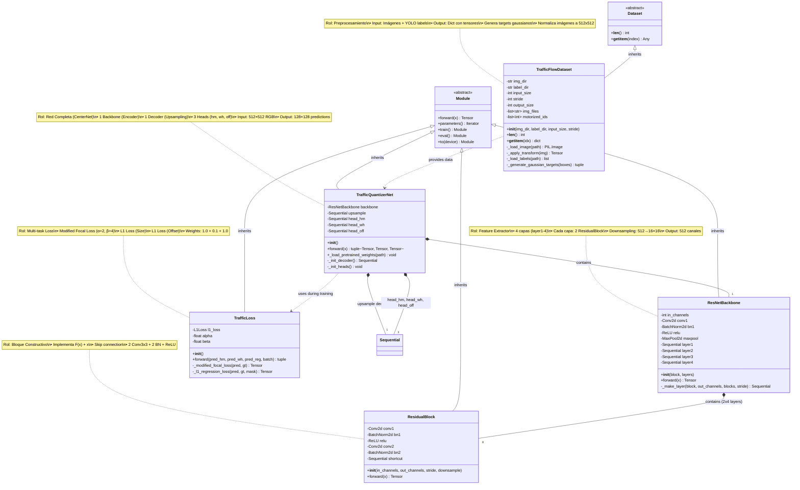
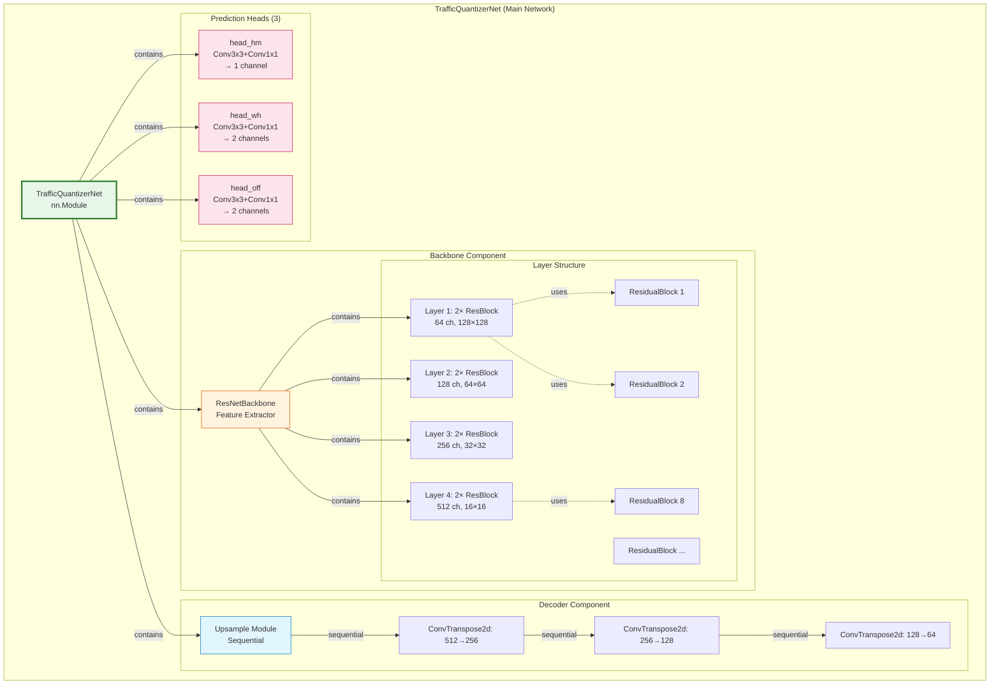

# Diagrama de Clases UML - TrafficQuantizerNet

## Sistema de Detección de Vehículos basado en CenterNet

### Diagrama Principal (5 Clases Core)



## Diagrama de Composición Detallado



## Tabla de Relaciones UML

| Clase Origen | Relación | Clase Destino | Tipo | Cardinalidad |
|--------------|----------|---------------|------|--------------|
| **TrafficFlowDataset** | Herencia | Dataset | Inheritance | - |
| **ResidualBlock** | Herencia | nn.Module | Inheritance | - |
| **ResNetBackbone** | Herencia | nn.Module | Inheritance | - |
| **TrafficQuantizerNet** | Herencia | nn.Module | Inheritance | - |
| **TrafficLoss** | Herencia | nn.Module | Inheritance | - |
| **TrafficQuantizerNet** | Composición | ResNetBackbone | Composition (◆) | 1 |
| **TrafficQuantizerNet** | Composición | Sequential (upsample) | Composition (◆) | 1 |
| **TrafficQuantizerNet** | Composición | Sequential (heads) | Composition (◆) | 3 |
| **ResNetBackbone** | Composición | ResidualBlock | Composition (◆) | 8 |
| **TrafficQuantizerNet** | Dependencia | TrafficLoss | Dependency (⋯>) | - |
| **TrafficFlowDataset** | Dependencia | TrafficQuantizerNet | Dependency (⋯>) | - |

## Leyenda de Símbolos UML

```
Herencia:          ───|>     (Triángulo vacío)
Composición:       ───◆      (Diamante relleno - ownership fuerte)
Agregación:        ───◇      (Diamante vacío - ownership débil)
Dependencia:       ⋯⋯⋯>     (Línea punteada - uso temporal)
Asociación:        ────      (Línea sólida - relación general)
```

## Detalles de Implementación

### 1. TrafficFlowDataset
```python
# Propósito: Cargar y preprocesar datos
# Retorna: {
#     'input': Tensor (3, 512, 512),
#     'hm': Tensor (1, 128, 128),      # Heatmap gaussiano
#     'wh': Tensor (2, 128, 128),      # Width, Height
#     'reg': Tensor (2, 128, 128),     # Offset dx, dy
#     'reg_mask': Tensor (128, 128)    # Máscara binaria
# }
```

### 2. ResidualBlock
```python
# Fórmula: output = F(x) + x
# Donde F(x) = BN(Conv(BN(Conv(x))))
# Si stride != 1: x pasa por downsample (Conv1x1)
```

### 3. ResNetBackbone
```python
# Arquitectura: ResNet-18
# Configuración: [2, 2, 2, 2] bloques por capa
# Flujo espacial: 512 → 256 → 128 → 64 → 32 → 16
# Canales: 3 → 64 → 64 → 128 → 256 → 512
```

### 4. TrafficQuantizerNet
```python
# Componentes:
# 1. backbone: ResNetBackbone (encoder)
# 2. upsample: Sequential de 3 ConvTranspose2d (decoder)
# 3. head_hm: Sequential (predicción de heatmap)
# 4. head_wh: Sequential (predicción de tamaño)
# 5. head_off: Sequential (predicción de offset)
```

### 5. TrafficLoss
```python
# Cálculo:
# loss_total = loss_hm + 1.0 * loss_off + 0.1 * loss_wh
#
# Componentes:
# - Modified Focal Loss: penaliza centros vs fondo
# - L1 Loss (Size): solo en píxeles con objetos
# - L1 Loss (Offset): solo en píxeles con objetos
```

## Flujo de Datos Completo

```
[Imagen Raw] 
    ↓
[TrafficFlowDataset]
    ↓
[Tensor 3×512×512] ──→ [TrafficQuantizerNet]
                            ↓
                        [ResNetBackbone]
                            ↓ (512×16×16)
                        [Upsample Decoder]
                            ↓ (64×128×128)
                        [3 Prediction Heads]
                            ↓
    ┌───────────────────────┼───────────────────────┐
    ↓                       ↓                       ↓
[Heatmap 1×128×128]   [Size 2×128×128]   [Offset 2×128×128]
    ↓                       ↓                       ↓
    └───────────────────────┴───────────────────────┘
                            ↓
                      [TrafficLoss]
                            ↓
                    [Loss Total Escalar]
                            ↓
                    [Backpropagation]
```

## Métricas de la Arquitectura

| Componente | Bloques | Parámetros | Dimensión Salida |
|------------|---------|------------|------------------|
| **Stem (conv1)** | 1 | 9.4K | 64 × 256 × 256 |
| **Layer 1** | 2 × ResBlock | 148K | 64 × 128 × 128 |
| **Layer 2** | 2 × ResBlock | 525K | 128 × 64 × 64 |
| **Layer 3** | 2 × ResBlock | 2.1M | 256 × 32 × 32 |
| **Layer 4** | 2 × ResBlock | 8.4M | 512 × 16 × 16 |
| **Upsample** | 3 ConvTranspose | 3.5M | 64 × 128 × 128 |
| **Heads** | 3 × Sequential | 40K | 5 × 128 × 128 |
| **TOTAL** | - | **~11.4M** | - |

